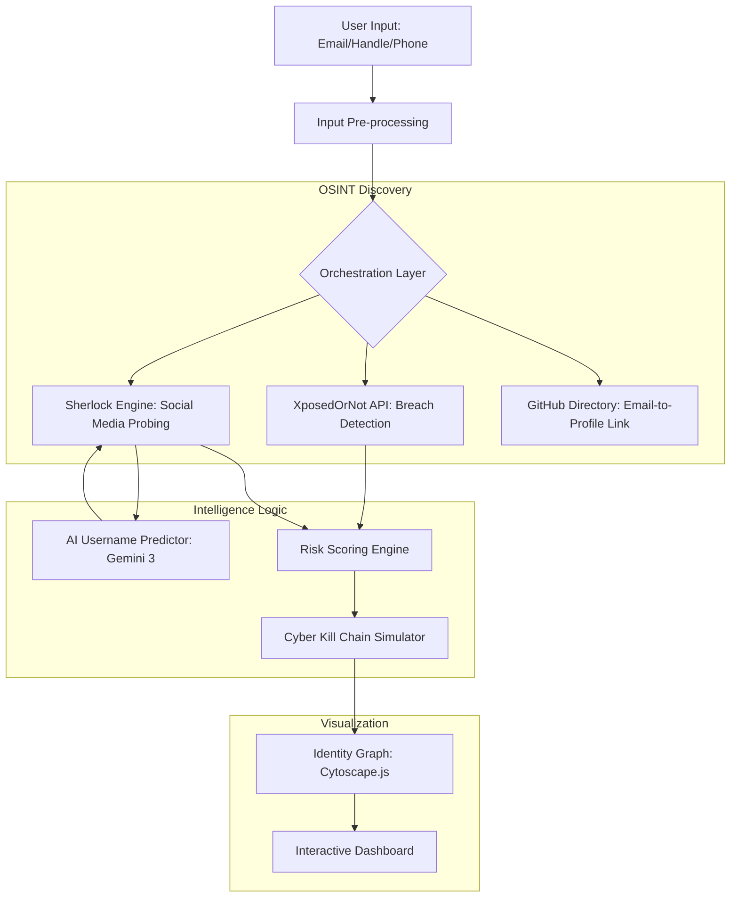

# 🛡️ PersonaTrace: Digital Identity & Exposure Intelligence Engine

[](https://opensource.org/licenses/MIT)
[](https://fastapi.tiangolo.com/)
[](https://reactjs.org/)
[](https://tailwindcss.com/)

**PersonaTrace** is an advanced defensive cybersecurity platform designed to visualize and quantify a target's digital footprint. By correlating data from historical breaches, social media anchors, and AI-predicted identity aliases, PersonaTrace builds a comprehensive map of an individual's attack surface.

---

## 🚀 Core Pillars

- **Identity Correlation Engine**: Links disparate identity fragments (emails, handles, phones) into a unified target graph.
- **AI-Powered Alias Prediction**: Leverages Large Language Models to predict potential username variations used by a target across the web.
- **Multi-Vector OSINT Discovery**: Combines high-speed Sherlock-based platform probing with deep-web breach analysis.
- **Predictive Risk Scoring**: A proprietary engine that quantifies cyber exposure (0-100) based on real-world threat vectors.
- **Simulated Cyber Kill Chain**: Translates raw exposure data into a human-readable narrative of how an adversary would weaponize the found data.

---

## 🏗️ System Architecture

PersonaTrace follows a modular pipeline designed for speed and investigative depth:



---

## 🛠️ Technical Stack

### **Backend (Intelligence Engine)**
- **Framework**: FastAPI (Asynchronous Python)
- **Investigation**: Sherlock Project (enhanced with multi-threaded HTTP probing)
- **AI Integration**: HuggingFace Inference (Gemini 3 models) for alias prediction
- **Data Validation**: Pydantic
- **Environment**: Python 3.9+

### **Frontend (Visual Interface)**
- **Framework**: React 18 + Vite (Ultra-fast HMR)
- **Styling**: Tailwind CSS 3 (Glassmorphism & Terminal aesthetics)
- **Graphing**: Cytoscape.js (Force-directed identity mapping)
- **Icons**: Lucide React
- **Animations**: CSS Variables + Micro-interactions

---

## 🔍 Deep Dive: Key Features

### 1. **Tiered Sherlock Engine**
Unlike standard OSINT tools, PersonaTrace uses a three-tier discovery process:
*   **Tier 1: Priority Probe**: Instantly scans top 25 high-impact platforms (GitHub, Reddit, Twitter, etc.).
*   **Tier 2: Direct Anchor Check**: Performs dedicated searches like the GitHub Email-API bridge.
*   **Tier 3: AI Expansion**: If a primary handle is found, it uses the AI Predictor to find "hidden" variants.

### 2. **Dynamic Risk Scoring**
The risk score isn't just a count; it weights exposure based on:
*   **Credential Leakage**: +20 points if passwords are confirmed in breaches.
*   **Identity Density**: Scaled bonus based on platform footprint.
*   **Alias Reuse**: Severe penalty if the same handle is used across all platforms (facilitates tracking).

### 3. **Attack Narrative Generator**
Translates complex data into three phases of a mock attack:
*   **Reconnaissance**: How an APT group identifies you.
*   **Weaponization**: How your leaked data forms a custom wordlist or phishing context.
*   **Exploitation**: The precise method (SIM Swap, Credential Stuffing) used to breach you.

---

## 📥 Installation & Setup

### **Prerequisites**
- [Node.js](https://nodejs.org/) (v16.x or higher)
- [Python](https://www.python.org/) (3.9 or higher)

### **1. Backend Configuration**
```bash
cd backend
python -m venv venv

# Activate Virtual Environment
# Windows:
venv\Scripts\activate
# macOS/Linux:
# source venv/bin/activate

pip install -r requirements.txt

# Create .env file
echo "HF_TOKEN=your_huggingface_token_here" > .env

uvicorn main:app --reload --port 8000
```

### **2. Frontend Configuration**
```bash
cd frontend
npm install
npm run dev
```

---

## 📖 Usage Guide

1.  Open `http://localhost:5173` in your browser.
2.  **Input Vector**: Provide an email (required) and an optional username.
3.  **Discovery**: Wait for the engine to perform the multi-platform trace (usually 10-15 seconds).
4.  **Interaction**: 
    *   Click on nodes in the **Identity Graph** to visit social profiles.
    *   Review the **Cyber Kill Chain** in the terminal console.
    *   Follow the **Actionable Recommendations** to secure your footprint.

> [!TIP]
> **Demonstration Mode**: To see the engine react to significant breaches and complex exposures, use the email `test@exposed.com` or `exposed@company.com`.

---

## 📁 Project Structure

```text
PersonaTrace/
├── backend/
│   ├── main.py          # API Gateway & Endpoints
│   ├── services.py      # Core OSINT & Risk Logic (The Brain)
│   ├── models.py        # Data Schemas
│   └── requirements.txt # Python Dependencies
├── frontend/
│   ├── src/
│   │   ├── components/  # Reusable UI (IdentityGraph, etc.)
│   │   ├── pages/       # Dashboard, Landing, RoleSelection
│   │   ├── App.jsx      # Router & Layout
│   │   └── index.css    # Global Styles & Tokens
│   └── package.json     # Node.js Dependencies
└── README.md            # You are here
```

---

## ⚖️ Security & Disclaimer

**PersonaTrace is intended strictly for educational and defensive purposes.** 
This tool is designed to help security professionals and individuals understand their own digital footprint. The project utilizes public OSINT methods and *mocked* breach data where necessary to demonstrate concepts without compromising real privacy. Please use responsibly and only on identities you have explicit permission to audit.

---
*Created for Ciphathon 2026 by Team DataYoddhas.*

